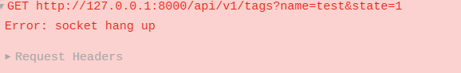

### 问题

服务端响应成功,客户端接收不到数据

搜索可知,是因为设置请求超时,server自动关闭当前连接,当客户端返回请求时,请求已断开,因此报错

查看配置文件可知

​		READ_TIMEOUT: 60

​		WRITE_TIMEOUT: 60

​	在viper解析yaml文件中,此时为60ns,但我们响应时间为39.985ms ,远远超过这个时间

因此,我们将超时时间设为6s.接口正常

#### 解决方法

​		更改设置响应时间,按秒设置
